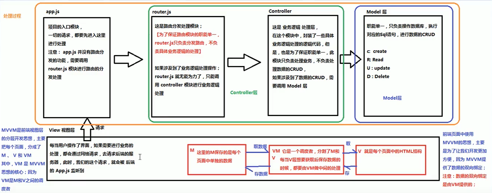

# Vue课程学习笔记

[toc]

课程地址：https://www.bilibili.com/video/av50680998?from=search&seid=17496618515973870494

目标：1.对vue以及前端有个基本的了解

​            2.能够快速实现前端开发，实现自己的想法

要求：1.**快速**过一遍所有课程，不求甚解（注意时间）

​            2.记录学习中的**关键**知识点（仅记录不熟悉或者可能供查阅的知识点）

## 1.语言介绍

知识点：vue 主要负责 MVC 中 V 的这一层。

知识点：vue减少了不必要的DOM操作（方便）。

----快速跳过----

关于MVC、MVVM的关系介绍，这次比较清楚了 VM 的作用，负责在前端的M和V之间的关系。

## 2.基本语法

### 2.1 v-cloak、v-text 和 v-html 

[知识点]：v-cloak 配合style可以解决插值闪烁问题

[知识点]：v-text 会替换元素中的值，但是缺乏文本拼接的能力

[知识点]：v-html 能把字符以html进行解析

### 2.2 v-bind 和 v-on

[知识点]：v-bind 主要绑定元素的属性，常见的有 name title 等

[知识点]：v-on 主要绑定的事件，常见的有 click mouseover 等

### 2.3 跑马灯项目（箭头函数、定时器用法）

[知识点]：箭头函数 ()=>{} 中的 this 和外部 this 指定一致

[知识点]：setInterval 和 clearInterval 的定时器使用

### 2.4 事件修饰符 stop、prevent、capture、self 和 once

[知识点]：stop 阻止事件被冒泡出去

[知识点]：prevent 阻止事件默认行为

[知识点]：capture 给事件注册捕获

[知识点]：self 只关注自身事件，不理睬冒泡或者捕获

[知识点]：once 事件只执行一次

### 2.5 v-mode双向绑定

[知识点]：v-model 中的变量双向绑定的是表单元素的值，比如  input 等

### 2.6 v-mode 实现的计算器案例

[知识点]：利用 v-model 把数据计算转移到 js 中，并使用了 eval 的计算

### 2.7 vue中的样式 :calss 和 :style

[知识点]：最好的办法是在 Vue 程序中将样式写入到 data 中进行配置

### 2.8 v-for 使用

[知识点]：可以循环数组、字典列表和字典等，最好和 :key 绑定一起使用

### 2.9 v-if 和 v-show 使用

[知识点]：v-if 和 v-show 都可以实现元素的隐藏，区别在于 v-if 是增删 dom，v-show 是 display: none 切换，因此，频繁切换用 v-show，少量切换用 v-if

======================  第一天课程结束 ============================

